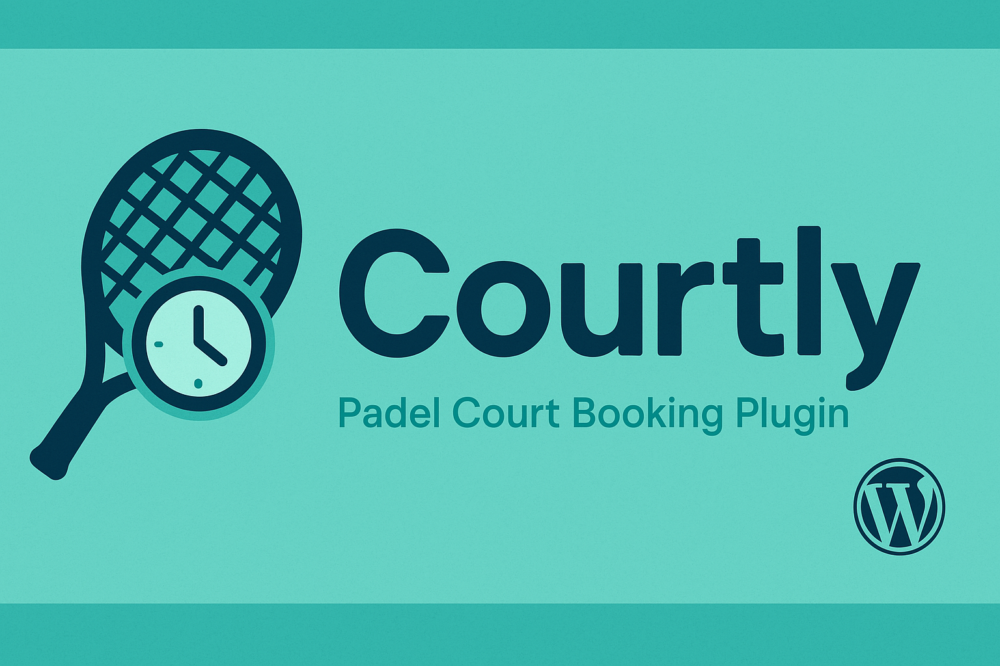

# Courtly - Padel Court Booking Plugin


[](https://github.com/juangcarmona/courtly-wp-plugin/releases)


Courtly is a modular WordPress plugin for managing **padel court reservations** with an interactive calendar, admin panel, and user-specific rules. It supports **members** and **guests** as well as custom user types, handling bookings, billing (Work in Progress), and availability with precision.

<figure>
  
  <figcaption>🥎 — Your padel court booking assistant. 🥎</br> Made with ❤️ by <a href=\"https://jgcarmona.com\" target=\"_blank\" rel=\"noopener\">Juan G Carmona</a> 🌍 Madrid, Spain</figcaption>
</figure>
---

## Features

- **Slot-based Booking System**: Book padel courts based on actual availability.
- **User Types**: Different rules for internal members vs. external guests.
- **Admin Panel**: Configure courts, define recurring blocks (e.g., lessons), set global hours.
- **Interactive Calendar**: Built with FullCalendar; users and admins get tailored views.
- **Dynamic Availability Calculation**: Based on rules, blocks, and reservations.
- **Modular Architecture**: Separation of domain, infrastructure, and UI concerns.
- **WordPress Native**: Built as a native plugin with full integration.
- **Billing Logic**: Internal users billed monthly; external users pay per booking (TBD).
- **Unified Calendar Module**: Reusable `calendar-general.js` powers both admin and public views.
- **Real-Time Booking from Calendar**: Admins and users can select time slots directly to book.
- **Reservation Rules Enforcement**: One reservation per user per day, max duration 60 minutes.

---

## Domain Model

### `UserType`
Defines user categories and their privileges.

- `id`, `name`, `max_days_in_advance`, `is_internal`

---

### `Court`
Represents each padel court.

- `id`, `name`, `surface`

---

### `OpeningHours`
Global opening/closing hours (applies to all courts).

- `id`, `day_of_week`, `open_time`, `close_time`

---

### `CourtBlock`
Recurring blocks for lessons, maintenance, etc.

- `id`, `court_id`, `day_of_week`, `start_time`, `end_time`, `reason`

---

### `CourtReservation`
Actual user booking.

- `id`, `court_id`, `user_id`, `user_type_id`, `start_datetime`, `end_datetime`, `price`, `status`

---

## Business Logic

- **Availability = OpeningHours – Recurring CourtBlocks – Reservations**
- **User booking window** limited by `max_days_in_advance`
- **Internal users** → tracked for monthly billing
- **External users** → must pay via payment gateway (TBD)
- **Past dates** are disabled in calendars

---

## Reservation Flow

### Admin Booking
- Admin selects a user and a time slot directly from the multi-court calendar (`resourceTimeGridDay`).
- Duration and court are automatically inferred.
- Business rules (max duration, 1/day) enforced on creation.

### Public Booking
- Authenticated users select an available slot on the calendar.
- Confirmation UI appears after selection.
- Rules are enforced automatically; payment integration planned.

---

## UI / UX Strategy

### Admin Area
- Weekly calendar to manage **Opening Hours** and **Recurring Blocks**
- Slot selection with reason tagging (e.g., "Class", "Maintenance")

### Public Area
- Monthly calendar view: number of **available 1h slots per day**
- Click to view **daily availability** by court
- Select slot → Confirm → (if external) Redirect to payment

---

## Structure Overview

```
courtly/
├── application/            # Application logic (services, commands, queries)
│   └── controllers/
├── domain/                 # Domain entities (Court, CourtBlock, etc.)
├── Infrastructure/         # Database repositories and setup
├── presentation/           # UI logic, separated by context
│   ├── admin/
│   │   ├── controllers/     # Admin-specific controllers
│   │   ├── css/             # Styles for admin UI
│   │   ├── js/              # Scripts for admin calendar and dashboard
│   │   ├── pages/           # Admin page entrypoints
│   │   ├── views/           # Reusable admin view fragments
│   │   └── AdminAssets.php  # Enqueues admin assets
│   ├── public/
│   │   ├── js/              # Frontend booking calendar scripts
│   │   └── shortcode.php    # Shortcode logic
│   └── shared/
│       ├── calendar/        # Shared calendar logic for admin/public
│       └── logger/          # JS logger
├── courtly.php             # Plugin bootstrap
└── tests/                  # Test files (future)
```

---

## Setup

Coming soon. A Docker-based WordPress environment is used for development.

---

## TODO

- Implement pricing and payment
- Add user reservation history
- Admin analytics and dashboards
- Email notifications and confirmations
